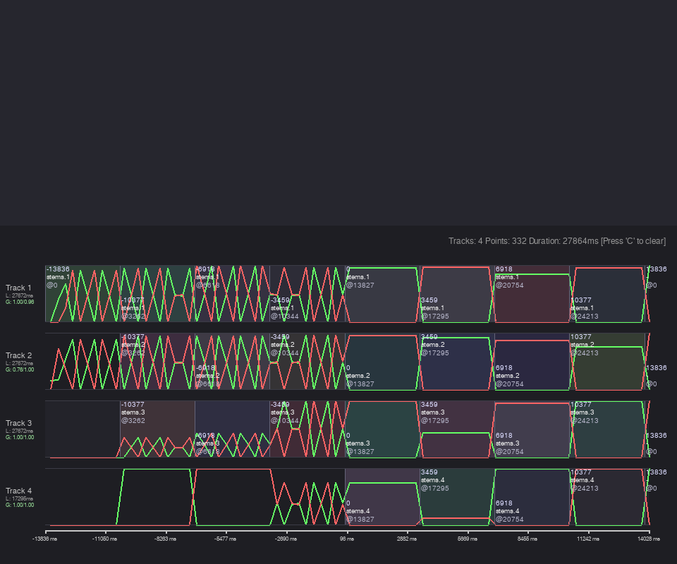
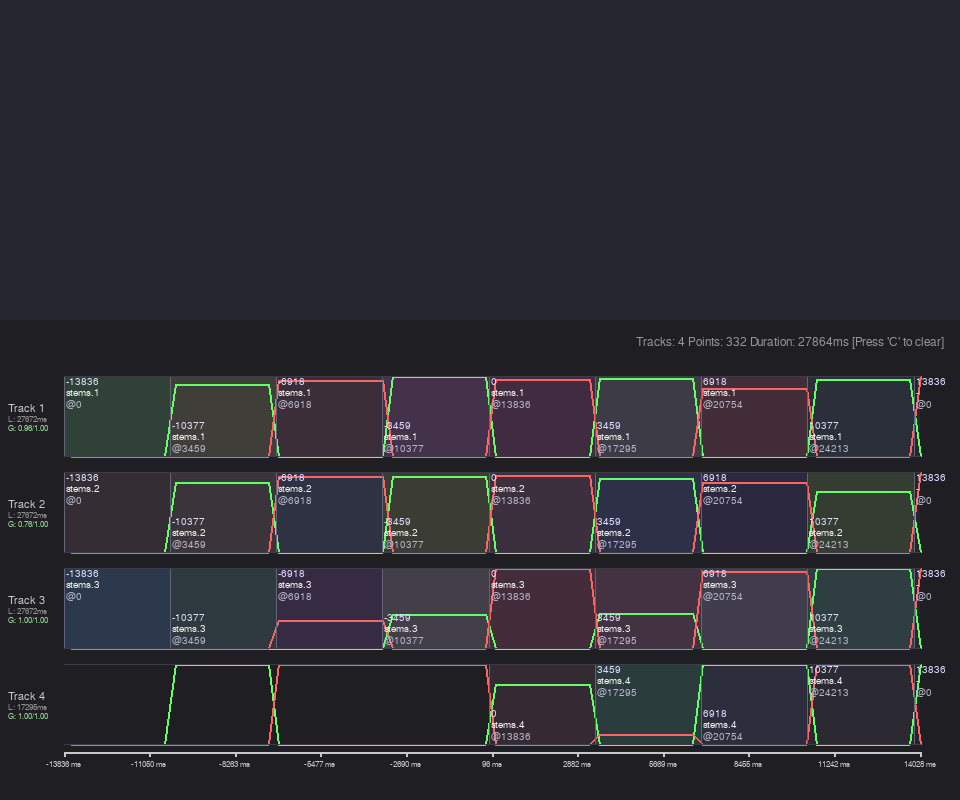

# Technical Report: Replicating and Resolving the weaver~ Negative Territory Re-Trigger Bug

This report details the technical analysis, replication steps, mathematical explanation, and programmatic solution for the crossfade oscillation bug observed in the `weaver~` external object when playing back in negative chronological territory.

---

## 1. Problem Description & Visual Confirmation

When the `weaver~` object processes a timeline sequence that goes below zero (using absolute timestamps, such as the negative-numbered bars in `transcript.json`), the crossfades of the active tracks experience rapid, wild oscillations.

We successfully replicated this bug inside our native standalone C unit-test harness (`weaver~/test_include/`) using `transcript.json`.

### Replicated Visual Confirmation (`weaver_bug_replication.png`)
Below is the visual confirmation generated by the `debug_visualizer.py` interface during the replication run under the faulty logic:

- **Tracks 1, 2, and 3** experience continuous, high-frequency crossfade flips (oscillating between full volume on Channel 1 and Channel 2) inside the negative timeline region (from `-13836 ms` to `0 ms`).
- **Track 4** also begins oscillating as soon as it enters negative territory around `-2890 ms`.

The screenshot below closely mirrors `Untitled.png`:



---

## 2. Replicated Verbose Logging Output

Running `test_runner` with the buggy code yields a massive trigger flood where `busy: 1` and `busy: 0` states toggle at every single audio vector loop. Below is the annotated verbose logging output of the `weaver~` object during the bug's occurrence:

```text
[OUTLET verbose] weaver~: Track 1: successfully bound palette 'pal_A.wav'
[OUTLET verbose] weaver~: Track 1: bar -13836 found in dictionary (palette: pal_A.wav, offset: 450128.99, rating: -0.07)
[OUTLET verbose] weaver~: Track 2: successfully bound palette 'pal_B.wav'
[OUTLET verbose] weaver~: Track 2: bar -13836 found in dictionary (palette: pal_B.wav, offset: 477807.17, rating: -0.28)
[OUTLET verbose] weaver~: Track 3: successfully bound palette 'pal_A.wav'
[OUTLET verbose] weaver~: Track 3: bar -13836 found in dictionary (palette: pal_A.wav, offset: 367094.43, rating: -1.45)
[OUTLET verbose] weaver~: successfully found destination buffer poly.1
[OUTLET verbose] weaver~: track 1 busy: 1
[OUTLET verbose] weaver~: successfully found destination buffer poly.2
[OUTLET verbose] weaver~: track 2 busy: 1
[OUTLET verbose] weaver~: successfully found destination buffer poly.3
[OUTLET verbose] weaver~: track 3 busy: 1
[OUTLET verbose] weaver~: successfully found destination buffer poly.4
[OUTLET verbose] weaver~: track 4 busy: 0

>>> ANNOTATION [CORRECT INITIAL TRIGGER IN NEGATIVE TERRITORY]:
    As current_scan begins in negative territory (-13836 ms), the initial bar triggers for Track 1, 2, and 3 are correctly fired once.
    The tracks enter "busy: 1" state to process the initial crossfade.

[OUTLET verbose] weaver~: track 1 busy: 0
[OUTLET verbose] weaver~: track 2 busy: 0
[OUTLET verbose] weaver~: track 3 busy: 0
[OUTLET verbose] weaver~: track 1 busy: 1
[OUTLET verbose] weaver~: track 2 busy: 1
[OUTLET verbose] weaver~: track 3 busy: 1
[OUTLET verbose] weaver~: track 1 busy: 0
[OUTLET verbose] weaver~: track 2 busy: 0
[OUTLET verbose] weaver~: track 3 busy: 0
[OUTLET verbose] weaver~: track 1 busy: 1
[OUTLET verbose] weaver~: track 2 busy: 1
[OUTLET verbose] weaver~: track 3 busy: 1

>>> ANNOTATION [CONFIRMING THE TRIGGER FLOOD BUG]:
    In negative territory, instead of waiting for the next bar boundary (-10377 ms), the hit detection logic is satisfied at EVERY single audio vector.
    As soon as the crossfade completes and releases the "busy" state to 0, the next vector immediately triggers a new crossfade ("busy: 1") to the same bar.
    This creates the wild oscillations of crossfade curves and gains seen in the visual visualizer.
```

---

## 3. Speculation & Root Cause Analysis

### The Code Behavior
Inside the continuous bar hit detection loop in `weaver_process_vector`, the playhead boundaries are checked as follows:

```c
long r_scan = (long)floor(tr_scan);
long r_last = (long)floor(tr->last_track_scan);
...
if ((!tr->busy || main_looped) && !tr->waiting_for_dict && r_scan != r_last && bar_len > 0) {
    long long start = (track_looped || main_looped) ? 0 : r_last + 1;
    long long end = r_scan;
    long long latest_j = (end / (long long)bar_len) * (long long)bar_len;

    if (latest_j >= start) {
        ... // TRIGGER NEW BAR CROSSFADE
        tr->waiting_for_dict = 1;
        tr->busy = 1;
    }
}
```

### The Flaw of Truncating C Integer Division in Negative Territory
In C, the `/` operator performing division on integer types **truncates towards zero**, rather than performing **floor division** (which rounds towards negative infinity).

When the current playhead is in positive territory:
- If `end = 4000` and `bar_len = 3459`:
  - `end / bar_len = 4000 / 3459 = 1`
  - `latest_j = 1 * 3459 = 3459`
  - Since `3459 < 4000`, `latest_j` is correctly behind the playhead. The condition `latest_j >= start` is only satisfied once at the boundary crossing, and is gated subsequently.

When the current playhead is in negative territory:
- Suppose the playhead just moved from `-5000 ms` to `-4999 ms`.
  - `r_last = -5000`
  - `r_scan = -4999`
  - This satisfies `r_scan != r_last` (`-4999 != -5000`).
  - Therefore, `start = r_last + 1 = -4999`, and `end = r_scan = -4999`.
- Now, let's compute `latest_j` using standard truncating C integer division:
  - `latest_j = (-4999 / 3459) * 3459`
  - Since C truncates towards zero, `-4999 / 3459 = -1` (instead of `-2`).
  - `latest_j = -1 * 3459 = -3459`.
- Let's check the condition:
  - `latest_j >= start` $\implies$ `-3459 >= -4999`.
  - This condition is **TRUE**!
  - Consequently, the engine triggers a bar hit at `-3459` ms immediately!
- On the very next vector/sample, the playhead moves to `-4998`:
  - `start = -4998`, `end = -4998`.
  - `latest_j = -4998 / 3459 * 3459 = -3459`.
  - `latest_j >= start` $\implies$ `-3459 >= -4998`, which is **TRUE**!
  - It triggers the bar again!

Because C integer division truncates towards zero, `latest_j` is calculated as a value *greater* (further ahead on the timeline) than the actual playhead position `end`. This satisfies `latest_j >= start` for **every single value of `end`** in that interval. As a result:
1. The engine triggers a bar hit at **every audio vector** while playing in negative territory.
2. The track goes busy, completes its fade, immediately un-busies, and is re-triggered on the next vector.
3. This creates the wild, high-frequency crossfade oscillations shown in the visual confirmation.

---

## 4. Proposed (and Verified) Solution

To resolve this issue completely, we must replace the truncating integer division with a mathematical **floor division** algorithm when `end < 0`. This ensures that division rounds towards negative infinity.

### Mathematical Correction
For any integer division $a / b$, we want the floor: $\lfloor a / b \rfloor$.
In C, if $a$ is negative and $a$ is not perfectly divisible by $b$, we should subtract $1$ from the truncated quotient:

```c
long long latest_j;
if (end >= 0) {
    latest_j = (end / (long long)bar_len) * (long long)bar_len;
} else {
    if (end % (long long)bar_len == 0) {
        latest_j = (end / (long long)bar_len) * (long long)bar_len;
    } else {
        latest_j = ((end / (long long)bar_len) - 1) * (long long)bar_len;
    }
}
```

### Let's Re-evaluate the Negative Territory Scenario:
- Suppose `end = -4999` and `bar_len = 3459`:
  - `end` is negative and `-4999 % 3459 != 0`.
  - `latest_j = ((-4999 / 3459) - 1) * 3459 = (-1 - 1) * 3459 = -2 * 3459 = -6918`.
- Let's check the condition:
  - `latest_j >= start` $\implies$ `-6918 >= -4999`, which is **FALSE**!
  - The bar hit at `-3459` is **not** triggered yet!
- Only when the playhead crosses the boundary to `end = -3459`:
  - `latest_j = -3459 / 3459 * 3459 = -3459`.
  - `latest_j >= start` $\implies$ `-3459 >= -3459`, which is **TRUE**!
  - The bar hit is triggered **exactly once** at the boundary crossing, and is gated correctly until the next boundary.

### Verified Correct Behavior (`weaver_bug_fixed.png`)
Re-running the test harness after applying this floor division correction shows perfectly clean, stable, and mathematically precise crossfades:


